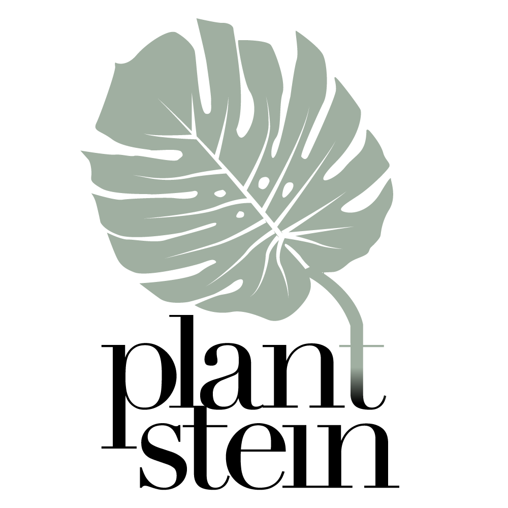

# Plant Stein - Group 11

## Video Demo
The video demo can be found [here](https://youtu.be/jHRoAGf7i0E).

## Purpose and Benefits
The goal of this project is to create an app that would simplify the life of any and all plant lovers out there. Our app, PlantStein, aims to help the user keep track of their plants well-being by monitoring the plants' environments. This includes keeping an eye on the room temperature and humidity around the plant, the amount of light the plant receives and the moisture level of its soil. The application will warn the user, whenever one of their plants is in a risk zone, by alerting them in app and by a notification by speaker.

All this aims to help plant enthusiasts of the world better and more accurately take care of their plants. And for the curious few an overview of how each plant has fared every week is also provided.

## How to Run This Project

- Start the backend server
- Copy frontend/.env.example to frontend/.env and set 'SERVER' to your local IP (which is logged by the server)
- Use flutter run or your IDE to start the app
- The flutter app should automatically add some test data. Plant #1 will be the plant the microcontroller sends data to.
- If you wish to emulate the microcontroller, use e.g. `mosquitto_pub -h localhost -m "{\"brightness\":700.0,\"temperature\":22,\"humidity\":70.0,\"moisture\":200.0}" -t "timeseries/1"` to publish mocked sensor data
- Now start the microcontroller (refer to the microcontroller README for more information)

Make sure of the following:

- Start the server first, then the app (so that it can create mock data), then the microcontroller (so that the room/plant for the microcontroller data actually exists)

## Tools
>  Eclipse Mosquitto broker  [Download here](https://mosquitto.org/download/) 

>  Arduino IDE  [WINDOWS](https://docs.arduino.cc/software/ide-v1/tutorials/Windows),  [MAC](https://docs.arduino.cc/software/ide-v1/tutorials/macOS),
[LINUX](https://docs.arduino.cc/software/ide-v1/tutorials/Linux)  

>  Wio terminal [Get started](https://wiki.seeedstudio.com/Wio-Terminal-Getting-Started/). Set up your wio terminal.  
>  In addition download the following [libraries](https://git.chalmers.se/courses/dit113/2023/group-11/plant-stein/-/tree/main/microcontroller#setup) 

>  Flutter SDK [Download here](https://flutter.dev/) 

## System design

[Diagram source code (PlantUML)](https://git.chalmers.se/courses/dit113/2023/group-11/plant-stein/-/blob/main/diagrams/system_design.puml)

The microcontroller reads data from the sensors and sends it over MQTT. The server subscribes to the relevant topics, saves the data in a database, and provides it to the app. The app lets the user interact with the system, and the microcontroller notifies the user with a sound and flashing LED when the conditions in the room change and a plant is no longer in its optimal environment.

## Team Information

- Adam Faundez Laurokari
- Fernando Ramiro Medina Mercado
- Michael König
- Parisa Babaei
- Sofia Serbina
- Anna Mäkinen

## Team Contributions
- Adam Faundez Laurokari
  - Setting up MQTT on microcontroller
  - Connecting sensors to microcontroller
  - Mapping sensors and actuator
  - Publishing sensor data
  - Show rooms screen, functionalities on the front-end and integration with server
  - Room details screen, functionalities on the front-end and integration with server
  - Statistics screen refactoring
  - Documentation for Customer Delivery
  - Requirement elicitation, user stories, acceptance criterias, and Git issues
  - Usability testing
  - UI prototype design
  - UI design change based on User-testing
  - General refactoring of UI

- Parisa Babaei
    - Setting up MQTT on microcontroller
    - Connecting sensors to microcontroller
    - Mapping sensors and actuator
    - Publishing sensor data
    - Microcontroller UI
    - Microcontroller Notification
    - Show rooms functionalities on the front-end and integration with server
    - Room details functionalities on the front-end and integration with server
    - Statistics screen integration with server
    - Documentation for Customer Delivery
    - Requirement elicitation, user stories, acceptance criterias, and Git issues
    - Usability testing
    - UI prototype design
    - UI design change based on User-testing

- Fernando Ramiro Medina Mercado
  - Setting up MQTT on microcontroller
  - Set up initial app codebase
  - On the frontend, I was in charge of the deleting plant screen.
  - Usability testing
  - Started with the Frontend CI pipeline, then it was improved by Michael.
  - Requirement elicitation, user stories, acceptance criterias, and Git issues

- Michael König
  - Set up server codebase: Spring Boot + JPA + OpenAPI (Swagger)
  - Server code in general, together with Sofia (e.g. API routes, repositories, …)
  - CI pipeline (incl. setup for automated testing, together with Sofia) with caching and exposing JUnit report to GitLab for GitLab Test Integration
  - Inserting test data (rooms + plants) when in debug mode
  - Creating API documentation (auto generated from code based on annotations)
  - Reading MQTT messages on the server and saving the data in DB
  - Check if conditions of plant are outside of perfect conditions and if they are, publish MQTT message saying what is wrong
  - Refactored sending sensor data from microcontroller as JSON (instead of on single topics)
  - On the frontend I focused mainly on refactoring + helping others when needed, as I’ve had previous experience with Flutter
  - Helping with integration of frontend with server (e.g. showing current conditions)
  - System Design diagram
  - Helped Sofia with Database Diagram
  - Many contributions to wiki (incl. taking notes on weekly meetups with TAs, general structure + sidebar, etc.)
  - Requirement elicitation, user stories, acceptance criterias and issues

- Sofia Serbina
  - UI prototype design
  - Initial sitemap
  - Insert species data in the database
  - Setting up MQTT connection on the server
  - Species details on the front-end and integration with the server
  - Onboarding
  - Loading screen
  - Automated testing using newman CLI and Postman JS library
  - Server code in general, together with Michael (e.g. API routes, repositories, …)
  - Created database diagram and updated it throughout the project
  - Contributed to the wiki
  - Requirement elicitation, user stories, acceptance criterias, and issues

- Anna Mäkinen
  - UI prototype design
  - All graphics, such as icons, pictures, and animations
  - Requirement elicitation, user stories, acceptance criterias, and Git issues
  - Helped with the initial sitemap
  - Helped Michael and Fernando with the front-end CI pipeline
  - Initial GUI scaffold creation
  - Front-end on Plant catalog, Plant details, and Statistics screens

